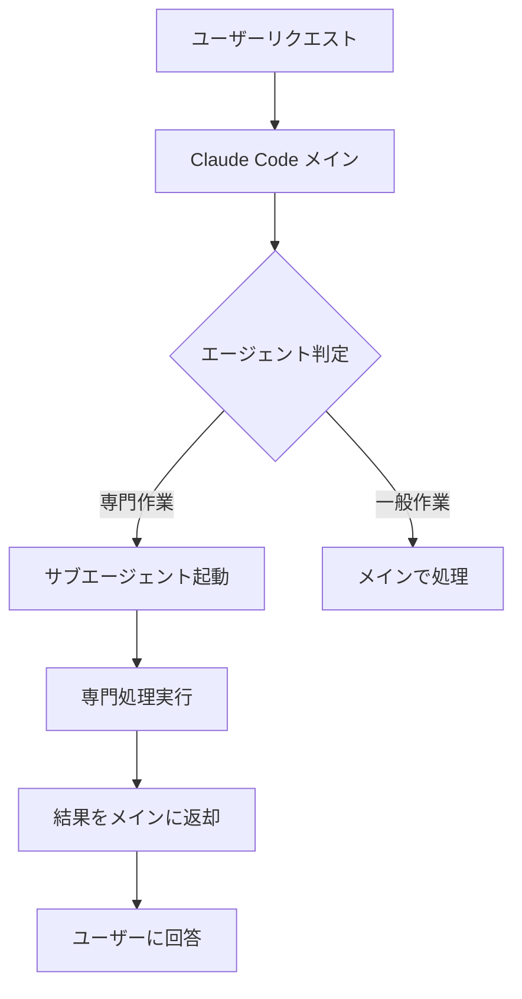

# サブエージェント機能詳細解説

Claude Codeサブエージェントシステムの技術仕様・設計思想・実装詳細

## 📋 目次

1. 概要
2. アーキテクチャ
3. エージェント設計パターン
4. 機能詳細
5. 技術仕様
6. カスタマイズガイド
7. トラブルシューティング

## 📖 概要

### サブエージェントとは

Claude Codeサブエージェントは、特定の開発タスクに特化したAIアシスタントです。メインのClaude Codeセッションから呼び出され、専門的な知識とコンテキストを持って特定の作業を実行します。

### 設計原則

1. **単一責任原則**: 各エージェントは1つの専門分野に集中
2. **再利用性**: 異なるプロジェクトで再利用可能
3. **拡張性**: 新しいエージェントの追加が容易
4. **一貫性**: 統一されたインターフェースと品質基準

## 🏗️ アーキテクチャ

### システム構成

```text
Claude Code (メインセッション)
├── .claude/
│   └── agents/
│       ├── test-generator.md
│       ├── bug-analyzer.md
│       ├── documentation-generator.md
│       ├── commit-message-generator.md
│       ├── security-scanner.md
│       ├── api-designer.md
│       ├── refactoring-advisor.md
│       └── code-reviewer.md
```

### エージェント呼び出しフロー



### ツール権限管理

各エージェントは必要最小限のツール権限のみを持ちます：

| エージェント | 読み取り | 編集 | 実行 | ネットワーク | 権限レベル |
|-------------|---------|------|------|-------------|------------|
| test-generator | ✅ | ✅ | ✅ | ✅ | 全権限 |
| bug-analyzer | ✅ | ✅ | ✅ | ✅ | 全権限 |
| refactoring-advisor | ✅ | ✅ | ✅ | ✅ | 全権限 |
| documentation-generator | ✅ | ✅ | ❌ | ✅ | 編集権限 |
| api-designer | ✅ | ✅ | ❌ | ✅ | 編集権限 |
| security-scanner | ✅ | ❌ | ❌ | ✅ | 読み取り専用 |
| code-reviewer | ✅ | ❌ | ❌ | ✅ | 読み取り専用 |
| commit-message-generator | ✅ | ❌ | ✅ | ❌ | 軽量git操作 |

## 🎨 エージェント設計パターン

### 標準エージェント構造

```markdown
---
name: [エージェント名]
description: [機能説明と使用場面]
tools: [使用可能ツールリスト]
model: [sonnet/haiku]
color: [表示色]
---

[システムプロンプト - 専門知識と指示]

## Core Responsibilities
[主要機能の詳細]

## Analysis Process  
[分析・処理手順]

## Quality Standards
[品質基準と制約]

## Output Format
[出力形式の定義]
```text

### モデル選択基準

#### Sonnet (高性能モデル)

- **適用場面**: 複雑な分析、設計、推論が必要
- **使用エージェント**: test-generator, bug-analyzer, documentation-generator, security-scanner, api-designer, refactoring-advisor, code-reviewer

#### Haiku (軽量モデル)  

- **適用場面**: 定型作業、高速処理が必要
- **使用エージェント**: commit-message-generator

## 🔧 機能詳細

### Test Generator

#### 核心機能

- **テストフレームワーク自動検出**: Jest, PyTest, JUnit など
- **AAA パターン適用**: Arrange-Act-Assert 構造
- **モック戦略**: 外部依存関係の適切なモック化
- **エッジケース生成**: 境界値、例外条件の網羅

#### 技術実装

```javascript
// 出力例: Jest テストスイート
describe('UserService', () => {
  let userService;
  let mockDatabase;
  
  beforeEach(() => {
    mockDatabase = {
      findById: jest.fn(),
      save: jest.fn()
    };
    userService = new UserService(mockDatabase);
  });
  
  describe('getUserById', () => {
    it('should return user when valid ID provided', async () => {
      // Arrange
      const userId = '123';
      const expectedUser = { id: '123', name: 'John Doe' };
      mockDatabase.findById.mockResolvedValue(expectedUser);
      
      // Act
      const result = await userService.getUserById(userId);
      
      // Assert
      expect(result).toEqual(expectedUser);
      expect(mockDatabase.findById).toHaveBeenCalledWith(userId);
    });
  });
});
```

### Bug Analyzer

#### 診断アルゴリズム

1. **エラー分類**: Runtime, Logic, Concurrency, Integration
2. **スタックトレース解析**: 呼び出し階層と失敗ポイント特定
3. **パターンマッチング**: 既知の問題パターンとの照合
4. **影響度評価**: 修正優先度の算定

#### 分析出力フォーマット

```markdown
## Bug Analysis Report

### Summary
[1-2行での問題概要]

### Root Cause
**Location**: file.py:line_number
**Category**: [Runtime Error/Logic Error/Concurrency/Integration]
**Severity**: [Critical/High/Medium/Low]

### Technical Details
[技術的詳細説明]

### Fix Recommendation
```python
# Before (問題のあるコード)
def problematic_function():
    return unsafe_operation()

# After (修正版)  
def fixed_function():
    try:
        return safe_operation()
    except SpecificException as e:
        handle_error(e)
        return default_value
```

### Prevention Strategy

[再発防止策]

```text

### Security Scanner

#### OWASP Top 10 検査エンジン
```python
# 検査パターン例
INJECTION_PATTERNS = [
    r"SELECT.*\+.*",  # SQL Injection
    r"exec\(.*input.*\)",  # Command Injection
    r"eval\(.*request.*\)",  # Code Injection
]

XSS_PATTERNS = [
    r"innerHTML\s*=.*request.*",  # DOM XSS
    r"document\.write\(.*user.*\)",  # Reflected XSS
]

CRYPTO_WEAKNESSES = [
    r"md5\(",  # Weak hash
    r"sha1\(",  # Weak hash  
    r"DES\(",  # Weak encryption
]
```

#### リスク評価マトリックス

| 脆弱性タイプ | 悪用しやすさ | 影響度 | 総合リスク |
|-------------|-------------|--------|-----------|
| SQLインジェクション | 高 | 高 | Critical |
| XSS | 中 | 中 | High |
| 認証不備 | 低 | 高 | High |
| 情報漏洩 | 中 | 中 | Medium |

### API Designer

#### 設計パターンライブラリ

```yaml
# REST API パターン
resource_patterns:
  collection: "GET /api/v1/users"
  item: "GET /api/v1/users/{id}"
  create: "POST /api/v1/users" 
  update: "PUT /api/v1/users/{id}"
  patch: "PATCH /api/v1/users/{id}"
  delete: "DELETE /api/v1/users/{id}"

# GraphQL Schema パターン
type_patterns:
  query: |
    type Query {
      user(id: ID!): User
      users(filter: UserFilter): [User!]!
    }
  mutation: |
    type Mutation {
      createUser(input: CreateUserInput!): UserPayload!
      updateUser(id: ID!, input: UpdateUserInput!): UserPayload!
    }
```

#### OpenAPI 生成テンプレート

```yaml
openapi: 3.0.0
info:
  title: "{API_NAME}"
  version: "{VERSION}"
  description: "{DESCRIPTION}"
  
paths:
  "{ENDPOINT}":
    get:
      summary: "{OPERATION_SUMMARY}"
      parameters:
        - name: "{PARAM_NAME}"
          in: query
          schema:
            type: "{PARAM_TYPE}"
      responses:
        200:
          description: "{SUCCESS_DESCRIPTION}"
          content:
            application/json:
              schema:
                "$ref": "#/components/schemas/{SCHEMA_NAME}"
```

## ⚙️ 技術仕様

### ファイル形式

#### Frontmatter (YAML)

```yaml
---
name: string           # エージェント識別名
description: string    # 機能説明（1-2文）
tools: array          # 使用可能ツール名リスト
model: enum           # sonnet | haiku
color: string         # UI表示色
---
```

#### システムプロンプト (Markdown)

- **第1セクション**: 役割定義と専門分野
- **第2セクション**: 核心機能の詳細
- **第3セクション**: 処理手順とワークフロー  
- **第4セクション**: 品質基準と制約
- **最終セクション**: 出力形式の定義

### 推奨ファイルサイズ

- **最小**: 1,000文字（基本的な機能定義）
- **推奨**: 2,000-4,000文字（詳細なガイドライン）
- **最大**: 6,000文字（複雑な専門エージェント）

### 命名規則

```text
{domain}-{function}.md

例:
- test-generator.md      # テスト生成
- bug-analyzer.md        # バグ解析
- api-designer.md        # API設計
- security-scanner.md    # セキュリティスキャン
```

## 🔨 カスタマイズガイド

### 新エージェント作成手順

#### 1. 要件定義

```markdown
## エージェント企画書
- **目的**: 何を解決するか
- **対象ユーザー**: 誰が使うか  
- **入力**: 何を受け取るか
- **出力**: 何を生成するか
- **専門知識**: どんな知識が必要か
```

#### 2. テンプレート作成

```bash
# 既存エージェントをベースにコピー
cp .claude/agents/test-generator.md .claude/agents/new-agent.md

# カスタマイズポイント
# - name と description の変更
# - tools の調整（最小権限の原則）  
# - model の選択（複雑さに応じて）
# - システムプロンプトの書き換え
```

#### 3. 段階的テスト

```markdown
## テスト計画
1. **基本機能**: 簡単なタスクで動作確認
2. **エッジケース**: 例外的な入力での検証
3. **統合テスト**: 他エージェントとの連携確認
4. **性能テスト**: 応答速度と品質の評価
```

### プロジェクト固有カスタマイズ

#### コーディング規約の反映

```markdown
## Your Custom Standards

**Naming Conventions:**
- Functions: camelCase (例: getUserData)
- Classes: PascalCase (例: UserService)  
- Constants: UPPER_SNAKE_CASE (例: MAX_RETRY_COUNT)

**Architecture Patterns:**
- State Management: Redux/Vuex pattern
- Error Handling: Result<T, E> type pattern
- Async Operations: async/await preferred over Promises
```

#### フレームワーク特化

```markdown
## Framework-Specific Guidelines

**React Patterns:**
- Hooks over Class Components
- Custom hooks for business logic
- PropTypes for type checking

**Vue Patterns:**  
- Composition API preferred
- Single File Components
- Vuex for complex state management
```

### チーム標準の統一

#### コミットメッセージ規約

```javascript
// .claude/agents/commit-message-generator.md カスタマイズ例

**Team-Specific Commit Types:**
- feat: 新機能
- fix: バグ修正  
- docs: ドキュメント更新
- style: コードフォーマット
- refactor: リファクタリング
- test: テスト追加・修正
- build: ビルド関連
- ci: CI設定変更
- perf: パフォーマンス改善
- revert: コミット取り消し

**Scope Examples:**
- auth: 認証関連
- api: API関連
- ui: UI/UXコンポーネント
- db: データベース関連
- config: 設定ファイル
```

## 🚨 トラブルシューティング

### よくある問題と解決法

#### エージェントが認識されない

```bash
# 問題: `/agents` コマンドでエージェントが表示されない

# 解決手順:
1. ファイルパス確認
   ls -la .claude/agents/

2. Frontmatter形式確認  
   head -10 .claude/agents/problem-agent.md

3. YAML構文確認
   # name, description, tools, model, color が正しく設定されているか
```

#### エージェントの応答品質が低い

```markdown
# 問題: 期待した出力が得られない

# 改善手順:
1. **システムプロンプト見直し**
   - 具体的な指示に変更
   - 例文・テンプレートの追加
   - 制約条件の明確化

2. **モデル変更検討**  
   - haiku → sonnet (高品質化)
   - sonnet → haiku (高速化)

3. **コンテキスト調整**
   - 必要な背景情報を追加
   - 出力形式の詳細化
```

#### ツール権限エラー

```yaml
# 問題: 必要なツールにアクセスできない

# tools セクション見直し:
tools: 
  - Task              # サブタスク起動
  - Bash              # コマンド実行  
  - Read              # ファイル読み取り
  - Edit              # ファイル編集
  - Write             # ファイル作成
  - Glob              # ファイル検索
  - Grep              # 内容検索
  - WebFetch          # Web取得
  - WebSearch         # Web検索
  
# セキュリティ原則: 最小必要権限のみ付与
```

### パフォーマンス最適化

#### 応答速度改善

```markdown
## 高速化テクニック

1. **モデル選択最適化**
   - 定型作業 → Haiku
   - 複雑な分析 → Sonnet

2. **プロンプト最適化**  
   - 冗長な説明削除
   - 核心部分に集中
   - 具体的な指示

3. **コンテキスト削減**
   - 不要な例文削除  
   - 重複内容の整理
```

#### メモリ使用量最適化

```markdown
## メモリ効率化

1. **大きなファイルの分割処理**
   - ストリーミング読み取り
   - チャンク分割処理

2. **ツール使用の最適化**
   - 必要最小限のツール権限
   - 適切なツール選択
```

### デバッグ手法

#### ログ出力での問題特定

```bash
# エージェント実行ログの確認
# (Claude Code の診断機能を活用)

# システムプロンプト確認
cat .claude/agents/target-agent.md | head -20

# ツール権限確認  
grep "tools:" .claude/agents/target-agent.md
```

#### ステップ実行でのデバッグ

```markdown
# 段階的検証アプローチ

1. **最小入力でテスト**
   単純なケースから開始

2. **中間出力確認**  
   各処理段階での結果確認

3. **エラー境界特定**
   どの段階で問題が発生するか特定
```

## 📚 参考資料

### 公式ドキュメント

- [Claude Code 公式ガイド](https://docs.anthropic.com/claude-code)
- [サブエージェント API リファレンス](https://docs.anthropic.com/claude-code/agents)

### コミュニティ

- [Claude Code GitHub Issues](https://github.com/anthropics/claude-code/issues)
- [開発者フォーラム](https://forum.anthropic.com/claude-code)

### ベストプラクティス集

- [エージェント設計パターン集](./AGENT_PATTERNS.md)
- [チーム活用事例集](./TEAM_CASES.md)
- [トラブルシューティング FAQ](./TROUBLESHOOTING_FAQ.md)

---

**サブエージェント機能を最大限活用し、開発チームの生産性向上を実現しましょう！** 🚀
